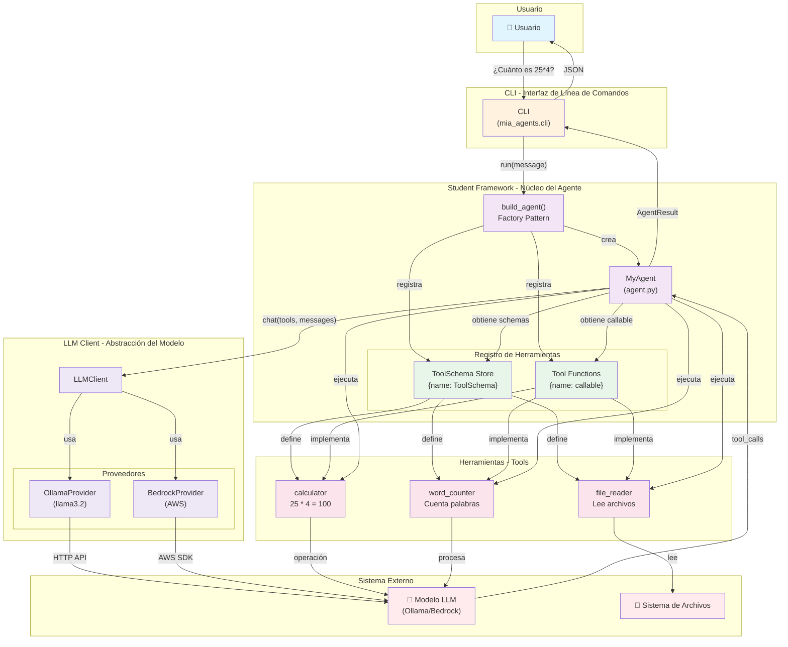

# Arquitectura C4 Level 2 - Componentes del Agente

## Diagrama C4 Level 2



## Detalles de Componentes

### 1. **CLI (mia_agents.cli)**
```
Responsabilidad: Interfaz de línea de comandos
Entrada: --message "¿Cuánto es 25 * 4?"
Procesa: Importa build_agent() y ejecuta agent.run()
Salida: JSON con AgentResult
```

### 2. **build_agent() - Factory Pattern**
```
Responsabilidad: Instanciar y configurar el agente
Pasos:
  1. Crea LLMClient (desde env o inyectado)
  2. Instancia MyAgent
  3. Registra 3 herramientas:
     - calculator
     - file_reader
     - word_counter
  4. Retorna el agente configurado
```

### 3. **MyAgent (agent.py)**
```
Responsabilidad: Orquestar el bucle del agente
Propiedades:
  - _llm: LLMClient (inyectado)
  - _tools: Dict[str, Callable] ← Funciones registradas
  - _schemas: Dict[str, ToolSchema] ← Esquemas para LLM
  - _max_iterations: int (máximo de pasos)
  
Métodos:
  - register_tool(callable, schema) → Registra herramienta
  - run(user_message) → Ejecuta bucle agente
```

### 4. **Registro de Herramientas**
```
ToolSchema Store (_schemas):
  {
    "calculator": ToolSchema(...),
    "file_reader": ToolSchema(...),
    "word_counter": ToolSchema(...)
  }

Tool Functions (_tools):
  {
    "calculator": <function calculator>,
    "file_reader": <function file_reader>,
    "word_counter": <function word_counter>
  }
```

### 5. **Herramientas (Tools)**

#### calculator.py
```python
Entrada: operand1, operator, operand2
Procesa: Operación aritmética (+, -, *, %)
Salida: String con resultado
```

#### file_reader.py
```python
Entrada: file_path
Procesa: Lee archivo UTF-8
Salida: Contenido del archivo o error
```

#### word_counter.py
```python
Entrada: text
Procesa: Cuenta palabras
Salida: "El texto contiene X palabra(s)."
```

### 6. **LLMClient - Abstracción**
```
Responsabilidad: Abstracción del modelo LLM
Protocolo: chat(messages, tools, system) → LLMResponse

Proveedores:
  - OllamaProvider: HTTP local (llama3.2:latest)
  - BedrockProvider: AWS (boto3)

El cliente traduce:
  - ToolSchema → formato nativo (Ollama/Bedrock)
  - Respuestas → LLMResponse normalizado
```

### 7. **Modelo LLM Externo**
```
Responsabilidad: Razonamiento y decisión
Entrada: messages + tools + system
Procesa: 
  - Analiza pregunta del usuario
  - Lee esquemas de herramientas disponibles
  - Decide si invocar herramienta
  - Genera respuesta
Salida: 
  - Si necesita tool: ToolCall(name, arguments)
  - Si no necesita: Texto de respuesta
```

---

## Flujo de Interacción

### 1️⃣ Inicialización
```
Usuario ejecuta CLI
    ↓
CLI importa build_agent()
    ↓
build_agent() crea MyAgent
    ↓
build_agent() registra 3 herramientas
    ↓
Agent listo con _tools y _schemas poblados
```

### 2️⃣ Primera Iteración
```
CLI llama agent.run("¿Cuánto es 25 * 4?")
    ↓
MyAgent crea messages = [{"role": "user", "content": "..."}]
    ↓
MyAgent llama llm.chat(messages, tools=[calculator, file_reader, word_counter])
    ↓
LLMClient traduce herramientas a formato nativo
    ↓
Ollama/Bedrock recibe schemas
    ↓
LLM analiza: "Es una operación, necesito calculator"
    ↓
LLM retorna ToolCall(name="calculator", arguments="{...}")
```

### 3️⃣ Ejecución de Herramienta
```
MyAgent parsea arguments JSON
    ↓
MyAgent busca tool_func = _tools["calculator"]
    ↓
MyAgent ejecuta calculator(operand1=25, operator="*", operand2=4)
    ↓
calculator retorna "100.0"
    ↓
MyAgent registra AgentStep(tool_name="calculator", tool_output="100.0")
    ↓
MyAgent agrega resultado a messages
```

### 4️⃣ Segunda Iteración
```
MyAgent llama llm.chat(messages_con_resultado, tools=[...])
    ↓
LLM lee el resultado "100.0"
    ↓
LLM genera respuesta final: "La respuesta es 100.0"
    ↓
LLM retorna LLMResponse(content="...", tool_calls=None)
    ↓
MyAgent ve tool_calls=None, termina bucle
    ↓
MyAgent retorna AgentResult(answer="...", steps=[...])
    ↓
CLI imprime JSON
    ↓
Usuario ve respuesta
```

---

## Matriz de Responsabilidades

| Componente | Responsabilidad | ¿Quién lo usa? |
|------------|-----------------|---|
| **CLI** | Interfaz entrada/salida | Usuario |
| **build_agent()** | Factory + registro | CLI |
| **MyAgent** | Orquestación bucle | build_agent() |
| **_tools** | Almacén de funciones | MyAgent.run() |
| **_schemas** | Almacén de esquemas | MyAgent.run() → LLMClient |
| **LLMClient** | Abstracción modelo | MyAgent |
| **OllamaProvider** | Implementación Ollama | LLMClient |
| **BedrockProvider** | Implementación AWS | LLMClient |
| **Herramientas** | Lógica de negocio | MyAgent (ejecución) |
| **LLM Externo** | Razonamiento | LLMClient (HTTP/SDK) |

---

## Puntos de Extensión

### ➕ Agregar nueva herramienta
```
1. Crear archivo student_framework/tools/mi_tool.py
2. Definir función con @Annotated types
3. Generar schema con ToolSchema.from_callable()
4. Registrar en build_agent(): agent.register_tool(...)
```

### ➕ Cambiar modelo LLM
```
Variables de entorno:
  - OLLAMA_MODEL="llama3.2:latest"
  - OLLAMA_HOST="http://localhost:11434"
  - BEDROCK_MODEL_ID="anthropic.claude-3-sonnet"
```

### ➕ Agregar memoria
```
M2: Agregar historial conversacional
  - Almacenar messages entre llamadas
  - Respetar max_history_messages
  - Implementar rolling window
```

