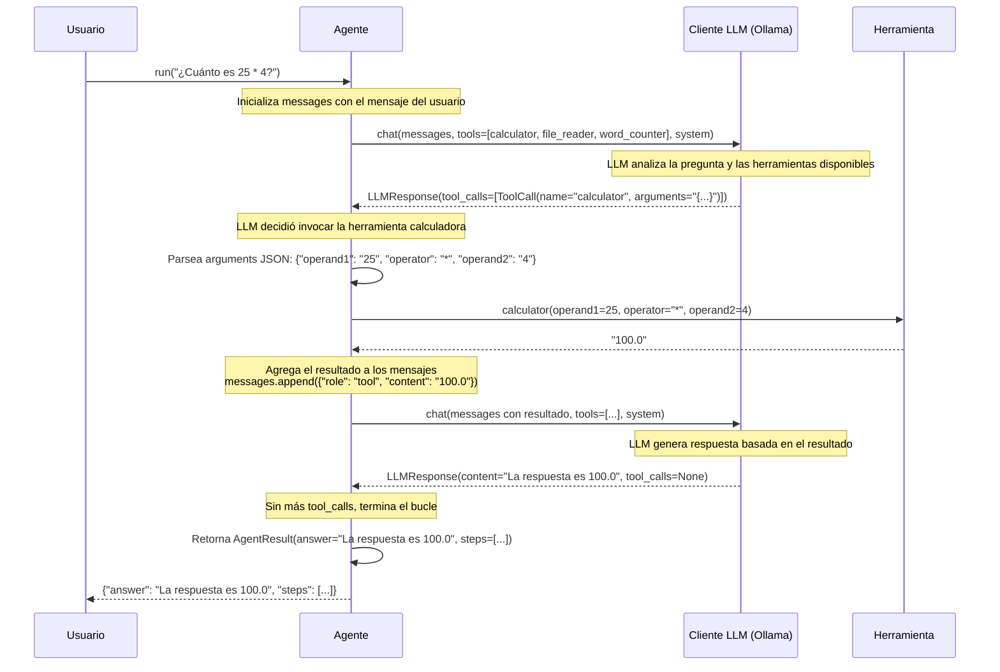
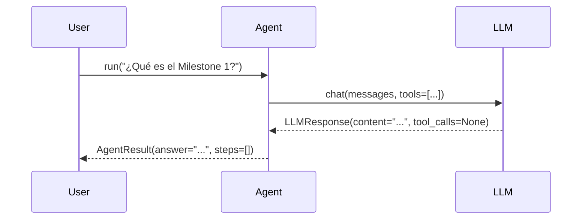
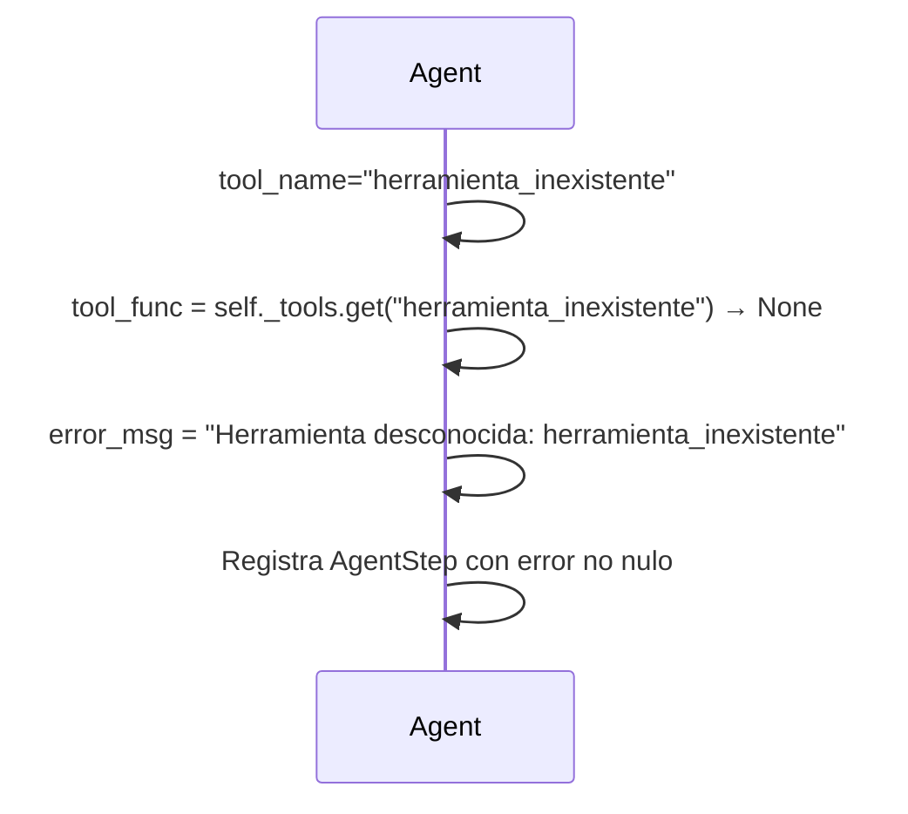

# Diagrama de Flujo del Agente - Milestone 1

## Diagrama de Secuencia



## Detalle del Flujo

### 1️⃣ **Inicialización**
```python
# En build_agent():
agent = MyAgent(llm_client)
agent.register_tool(calculator, calculator_schema)
agent.register_tool(file_reader, file_reader_schema)
agent.register_tool(word_counter, word_counter_schema)
```

### 2️⃣ **Primera Llamada al LLM**
```python
# En agent.run():
messages = [{"role": "user", "content": "¿Cuánto es 25 * 4?"}]
response = llm.chat(
    messages=messages,
    tools=[calculator_schema, file_reader_schema, word_counter_schema],  # ✅ SIEMPRE se pasan
    system="Eres un asistente útil."
)
```

**LLM recibe:**
- El mensaje del usuario
- Lista de herramientas disponibles con sus esquemas (name, description, parameters)
- System prompt

**LLM decide:**
- ¿Necesito una herramienta? → Sí, necesito calculadora
- Emite: `ToolCall(name="calculator", arguments='{"operand1": "25", "operator": "*", "operand2": "4"}')`

### 3️⃣ **Ejecución de la Herramienta**
```python
# El agente parsea los argumentos
arguments = json.loads('{"operand1": "25", "operator": "*", "operand2": "4"}')
# arguments = {"operand1": "25", "operator": "*", "operand2": "4"}

# Obtiene la función registrada
tool_func = self._tools["calculator"]

# La ejecuta con los argumentos
result = tool_func(**arguments)  # calculator(operand1="25", operator="*", operand2="4")
# result = "100.0"

# Registra el paso
steps.append(AgentStep(
    tool_name="calculator",
    tool_input='{"operand1": "25", "operator": "*", "operand2": "4"}',
    tool_output="100.0",
    error=None
))
```

### 4️⃣ **Segunda Llamada al LLM (con Resultado)**
```python
# Agrega el resultado de la herramienta a los mensajes
messages.append({"role": "assistant", "content": None})  # Respuesta del LLM con tool_call
messages.append({"role": "tool", "content": "100.0", "tool_use_id": "..."})

# Llama al LLM nuevamente con el resultado
response = llm.chat(
    messages=messages,  # Ahora contiene el resultado de la herramienta
    tools=[...],
    system="..."
)
# LLM responde: "La respuesta es 100.0"
```

### 5️⃣ **Terminación**
```python
# Si response.tool_calls es vacío/None, termina
if not response.tool_calls:
    return AgentResult(
        answer="La respuesta es 100.0",
        steps=[AgentStep(...)]
    )
```

## Casos Especiales

### Caso A: Respuesta sin Herramientas

**Resultado:** 1 llamada al LLM, 0 herramientas invocadas

### Caso B: Herramienta Desconocida


### Caso C: Máximo de Iteraciones
```python
# Si el bucle alcanza max_iterations sin obtener respuesta final:
for _ in range(self._max_iterations):  # 10 por defecto
    response = llm.chat(...)
    if not response.tool_calls:  # ← Si nunca llega aquí
        return AgentResult(...)

# Después de 10 iteraciones:
return AgentResult(
    answer="Máximo de iteraciones alcanzado.",
    steps=steps
)
```

## Estructura de Datos

### ToolSchema (Definición de Herramienta)
```python
ToolSchema(
    name="calculator",
    description="Realiza operaciones aritméticas...",
    parameters={
        "type": "object",
        "properties": {
            "operand1": {"type": "number", "description": "..."},
            "operator": {"type": "string", "enum": ["+", "-", "*", "%"]},
            "operand2": {"type": "number", "description": "..."}
        },
        "required": ["operand1", "operator", "operand2"]
    }
)
```

### ToolCall (Invocación)
```python
ToolCall(
    id="calc_call_1",
    name="calculator",
    arguments='{"operand1": "25", "operator": "*", "operand2": "4"}'  # JSON string
)
```

### AgentStep (Registro)
```python
AgentStep(
    tool_name="calculator",
    tool_input='{"operand1": "25", "operator": "*", "operand2": "4"}',
    tool_output="100.0",
    error=None
)
```

### AgentResult (Respuesta Final)
```python
AgentResult(
    answer="La respuesta es 100.0",
    steps=[AgentStep(...)],
    error=None,
    input_tokens=None,
    output_tokens=None
)
```

## Decisiones de Diseño

| Aspecto | Decisión | Razón |
|--------|----------|-------|
| **Registro de Herramientas** | Dict `{name: callable}` | Búsqueda O(1) rápida por nombre |
| **Esquemas** | Dict `{name: ToolSchema}` | Pasar siempre al LLM, sin None |
| **Argumentos JSON** | String → dict → argumentos | Compatible con Ollama y Bedrock |
| **Conversión de Tipos** | float() en calculadora | Llama envía strings, no números |
| **Manejo de Errores** | Registra error, continúa | Robusto ante herramientas inválidas |
| **Max Iterations** | 10 por defecto | Evita bucles infinitos |
| **Pasar siempre tools** | `tools=list(self._schemas.values())` | No None: LLM debe conocer opciones |

